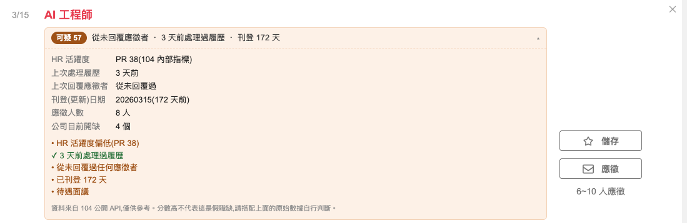

# 幽靈職缺偵測器(104 非官方)

在 104 人力銀行的職缺上,直接顯示 **HR 到底有沒有在處理履歷**。

> 本專案由第三方獨立開發,**與 104 資訊科技股份有限公司無任何隸屬或合作關係**。
> 「104」為其權利人之商標,此處僅用於說明本外掛的適用範圍。

📖 [安裝說明頁面](https://fansia.github.io/104-ghost-job-detector/)



> 右下角 104 自己只顯示「6~10 人應徵」,徽章給的是精確的 **8 人**;
> 而「從未回覆過任何應徵者」這件事,104 從頭到尾不會告訴你。

104 的資料庫其實記錄了每個職缺「上次處理履歷」和「上次回覆應徵者」的時間,而且透過公開 API 就查得到——但 104 只會在頁面上顯示正面的那一半(例如「7 天內處理過履歷」),從不告訴你這家公司**從來沒有回覆過任何應徵者**。這個外掛把另一半補上。

## 安裝

**Chrome 線上應用程式商店:**送審中,通過後會在此附上連結。

**手動安裝(現在就能用):**

1. 到 [Releases](https://github.com/fansia/104-ghost-job-detector/releases/latest) 下載 zip 並解壓縮
   (或直接 clone 本專案)
2. 打開 Chrome,進入 `chrome://extensions/`
3. 開啟右上角的「開發人員模式」
4. 點「載入未封裝項目」,選擇解壓縮後的資料夾
5. 到 [104 找工作](https://www.104.com.tw/jobs/search/) 搜尋任何職缺

> 手動安裝不會自動更新。有新版時回到 Releases 重新下載,
> 並在 `chrome://extensions/` 點該外掛的「重新載入」。

## 打包

```bash
./build.sh    # 產生 dist/ghost-job-detector-<version>.zip,供 Releases 發佈
```

## 它會顯示什麼

每個職缺卡片和職缺內頁會多出一列徽章:

```
[留意 32]  從未回覆應徵者 ・ 11 天沒處理履歷 ・ 4 人應徵          ▾
```

點開之後是完整的原始數據:

| 項目 | 說明 |
|---|---|
| HR 活躍度 | 104 內部的 `hrBehaviorPR`,0~100 的百分位 |
| 上次處理履歷 | HR 最後一次點開履歷是幾天前 |
| 上次回覆應徵者 | 公司最後一次真的回覆是幾天前(常常是「從未回覆過」) |
| 刊登(更新)日期 | 原始日期,不是 104 顯示的相對時間 |
| 應徵人數 | 精確數字,不是「30 人以上」 |
| 公司目前開缺 | 同時開幾個缺,用來看是不是在養人才庫 |
| 觀察到重新刊登 | 本外掛長期追蹤到這個缺被重貼幾次 |

## 評分規則

分數 0~100,由以下訊號加總(定義在 `src/score.js`):

| 訊號 | 分數 |
|---|---|
| HR 活躍度 PR < 30 / < 50 | +30 / +15 |
| 超過 14 天 / 7 天沒處理履歷 | +25 / +12 |
| 從未回覆過應徵者 | +20 |
| 上次回覆超過 90 天 / 30 天 | +12 / +6 |
| 刊登超過 90 / 60 / 30 天 | +18 / +12 / +6 |
| 50 人以上應徵但一週沒處理 | +10 |
| 公司同時開 30 / 15 個缺以上 | +10 / +5 |
| 觀察期間重新刊登 2 次以上 | +15 |
| 待遇面議 | +4 |

分級:`0–19 正常` / `20–39 留意` / `40–64 可疑` / `65+ 高風險`

**0 人應徵的職缺不套用互動訊號。** 沒人投,就沒有履歷可處理、也沒有人可以回覆,
`interactionRecord` 是空的是數學上的必然,不是「已讀不回」的證據 ——
這時「沒處理履歷」和「從未回覆」都不扣分,改顯示中性提示。
刊登時長等其他訊號照算(掛了半年還 0 人投,本身就值得留意)。

**分數只是排序用的摘要。** 把真職缺誤標成假的,對求職者和公司都是傷害,所以 UI 一律同時呈現原始數據,讓使用者自己判斷,而不是給一個武斷的結論。權重是憑經驗訂的,歡迎依實際情況調整。

## 資料來源

全部來自 104 的公開 API,以同源請求在使用者自己的瀏覽器中發出,不經過任何第三方伺服器:

| 用途 | 端點 |
|---|---|
| 搜尋結果 | `GET /jobs/search/api/jobs` |
| 職缺內頁 | `GET /job/ajax/content/{jobCode}` |
| 公司職缺(含 `interactionRecord`) | `GET /api/companies/{custCode}/jobs` |

`interactionRecord` 是關鍵欄位:

```json
{
  "lastProcessedResumeAtTime": 1788139633,
  "lastCustReplyTimestamp": null,
  "nowTimestamp": 1788228579
}
```

`lastCustReplyTimestamp` 為 `null` 代表這個職缺**從未回覆過任何應徵者**。

## 隱私

- 不蒐集、不上傳任何資料
- `chrome.storage.local` 只存 API 快取(最長 6 小時)與職缺觀察紀錄,全部留在本機
- 可從擴充功能彈出視窗一鍵清除

## 架構

```
manifest.json      MV3 設定
build.sh           打包成 Releases 用的 zip
src/util.js        日期正規化、快取、請求佇列(同時最多 2 個請求)
src/api.js         104 API 封裝
src/score.js       訊號 → 分數
src/badge.js       徽章 UI
src/content.js     頁面偵測、DOM 注入、虛擬捲動處理
src/popup.html/js  開關與快取管理
icons/             擴充功能圖示
docs/              GitHub Pages 安裝說明頁
```

### 幾個實作上的坑

- **搜尋結果用 `vue-recycle-scroller`**,卡片 DOM 會被回收重用。每次注入前都要比對 `data-job-no`,並在 await 前後確認卡片還是同一個職缺,否則徽章會貼到別的職缺上。
- **搜尋 API 一頁不一定回 20 筆**(有置頂職缺時會更多),所以不能用卡片索引推算頁碼,要從第一頁循序往後找。
- **同一頁會被多張卡片同時請求**,必須共用同一個 Promise 並等它完成;先標記「已取得」再去 fetch 會讓後到的呼叫拿到空資料。
- **content script 跑在 isolated world**,不受 104 頁面 CSP 的 `connect-src` 限制。

## 已知限制

- 104 沒有公開「首次刊登日期」,`appearDate` 只是最後更新日。真正的刊登時長要靠外掛長期累積觀察紀錄。
- 應徵人數只有搜尋 API 有,公司職缺 API 和職缺詳細頁 API 都沒有(它們的 `userApplyCount` 是「你自己投過幾次」)。
  搜尋 API 又沒有任何以公司過濾的參數,只能用公司名稱當關鍵字撈再比對 `custCode`。
  所以在公司頁和職缺內頁,公司名稱夠特殊時能完整對上,名稱通用(會被斷詞成「保險」「銀行」之類)時只撈得到一部分,對不到的就不顯示應徵人數。
- 依賴 104 未公開文件的 API,對方改版可能失效。
- `hrBehaviorPR` 的確切計算方式是 104 的內部邏輯,我們只知道它是活躍度百分位。

## 後續方向

群眾回報:讓使用者一鍵回報「投了 X 公司,N 天沒回覆」,累積各公司的實際回覆率。這是目前連國外同類工具都做得很淺的一塊。

## 授權

[MIT](LICENSE)。隱私權政策見 [PRIVACY.md](PRIVACY.md)。
